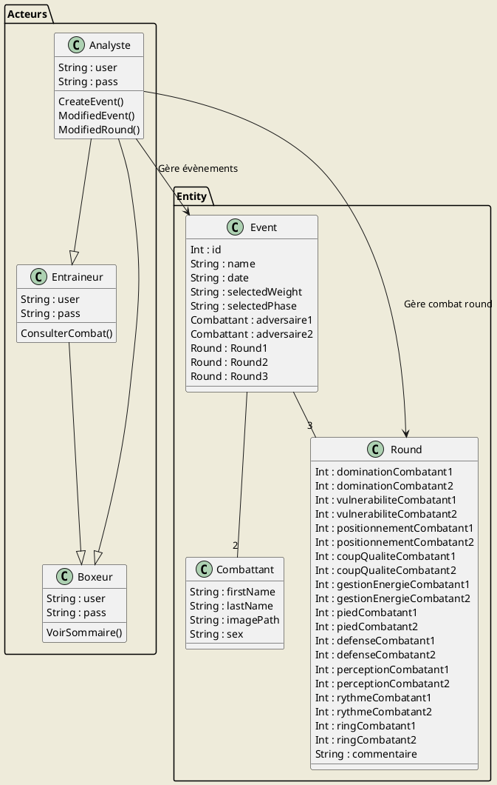

```plantuml
@startuml

skinparam backgroundColor #EEEBDA

namespace Entity {

class "Round" AS Round {
    Int : dominationCombatant1
    Int : dominationCombatant2
    Int : vulnerabiliteCombatant1
    Int : vulnerabiliteCombatant2
    Int : positionnementCombatant1
    Int : positionnementCombatant2
    Int : coupQualiteCombatant1
    Int : coupQualiteCombatant2
    Int : gestionEnergieCombatant1
    Int : gestionEnergieCombatant2
    Int : piedCombatant1
    Int : piedCombatant2
    Int : defenseCombatant1
    Int : defenseCombatant2
    Int : perceptionCombatant1
    Int : perceptionCombatant2
    Int : rythmeCombatant1
    Int : rythmeCombatant2
    Int : ringCombatant1
    Int : ringCombatant2
    String : commentaire
}

Event -- "3" Round
Event -- "2" Combattant

class "Event" AS Event {
    Int : id
    String : name
    String : date
    String : selectedWeight
    String : selectedPhase
    Combattant : adversaire1
    Combattant : adversaire2
    Round : Round1
    Round : Round2
    Round : Round3
}

class "Combattant" AS Combattant {
    String : firstName
    String : lastName
    String : imagePath
    String : sex
}

}
namespace Acteurs {
    class "Analyste" AS Analyste {
    String : user
    String : pass
    
    CreateEvent()
	ModifiedEvent()
	ModifiedRound()
}

class "Entraineur" AS Entraineur {
    String : user
    String : pass
    
    ConsulterCombat()
}

class "Boxeur" AS Boxeur {
    String : user
    String : pass
    
    VoirSommaire()
}
Entraineur --|> Boxeur
Analyste --|> Boxeur
Analyste --|> Entraineur
}

Acteurs.Analyste --> Entity.Round : Gère combat round

Acteurs.Analyste --> Entity.Event : Gère évènements


@enduml
```